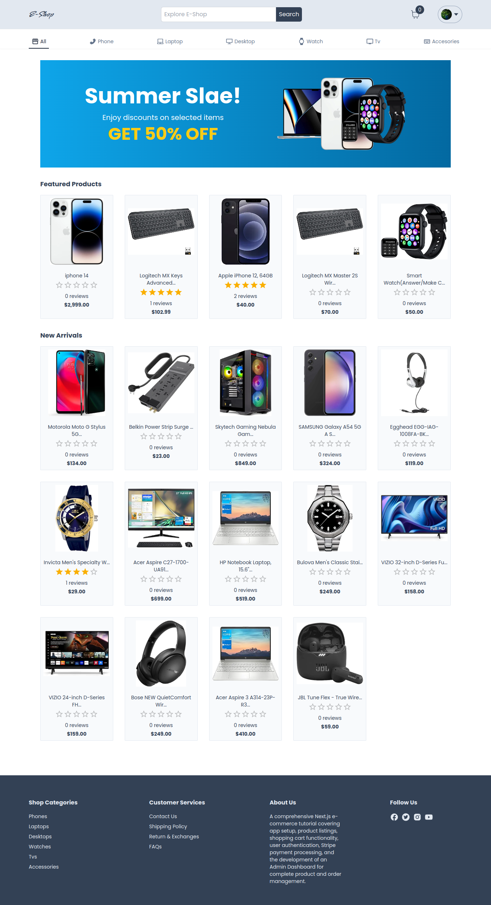

This is a [Next.js](https://nextjs.org/) project bootstrapped with [`create-next-app`](https://github.com/vercel/next.js/tree/canary/packages/create-next-app).

# E-Shop Project

Welcome to the E-Shop project! This e-commerce application is built with a focus on providing a seamless shopping experience and includes a variety of features to enhance both user and administrator interactions.

## Features

- 🖌️ Awesome UI in TailwindCSS
- 🛒 Complete Shopping Cart
- 🔐 Authentication with Google Login in Next Auth
- 💰 Payment Integration with Stripe
- 👀 Admin Dashboard
- 📉 Shop Statistics (Summary)
- ⬆️ Image Uploads in Firebase Storage
- 🔎 Search Functionality
- 👨‍👩‍👧‍👦 Product Categories
- 🔥 Product Rating
- 🛠️ Manage Products
- 🛠️ Manage Orders

## Getting Started

Follow these steps to get the E-Shop project up and running on your local machine.

### Prerequisites

Make sure you have the following installed:

- [Node.js](https://nodejs.org/)
- [npm](https://www.npmjs.com/) or [Yarn](https://yarnpkg.com/)

### Installation

1. Clone the repository:

   ```bash
   git clone https://github.com/Mdromi/e-shop.git
   cd e-shop
   ```
1. Install dependencies::

   ```bash
    npm install
    # or
    yarn
   ```

### Configuration

### Example Environment Variables

Create a `.env` file in the root of the project using the provided example. Fill in the values with your actual credentials.

#### Example `.env`

    ```bash
    # Stripe Configuration
    STRIPE_SECRET_KEY=YOUR_STRIPE_SECRET_KEY
    NEXT_PUBLIC_STRIPE_PUBLISHABLE_KEY=YOUR_STRIPE_PUBLISHABLE_KEY
    STRIPE_WEBHOOK_SECRET=YOUR_STRIPE_WEBHOOK_SECRET

    # NextAuth Configuration
    NEXTAUTH_SECRET=YOUR_NEXTAUTH_SECRET
    GOOGLE_CLIENT_ID=YOUR_GOOGLE_CLIENT_ID
    GOOGLE_CLIENT_SECRET=YOUR_GOOGLE_CLIENT_SECRET

    # Database Configuration (if applicable)
    DATABASE_URL=YOUR_DATABASE_URL
    ```
## Running the Application

First, run the development server:

```bash
npm run dev
# or
yarn dev
```

Open [http://localhost:3000](http://localhost:3000) with your browser to see the result.

# E-Shop

Sleek e-commerce platform with Next.js, TailwindCSS, Google Login, Stripe integration, and Firebase support for hassle-free online shopping.



